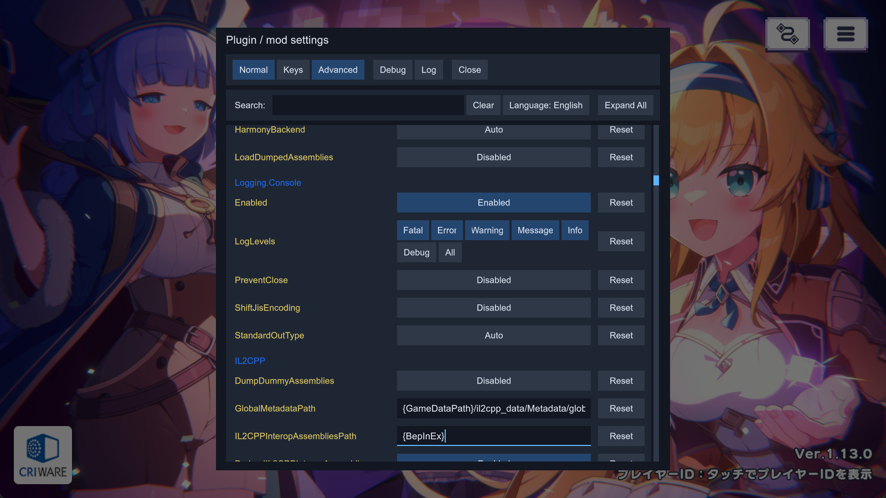

## Plugin / mod configuration manager for BepInEx
An easy way to let user configure how a plugin behaves without the need to make your own GUI. The user can change any of the settings you expose, even keyboard shortcuts.

The configuration manager can be accessed in-game by pressing the hotkey (by default F1). Hover over the setting names to see their descriptions, if any.



## How to use
There are two versions of this plugin, for BepInEx 5 (version 5.4.20 or newer, mono only) and BepInEx 6 (nightly build 664 or newer, IL2CPP only).

- Install and configure the correct BepInEx version for your game (see above).
- Download latest release for your BepInEx from this fork's [Releases](https://github.com/anosu/BepInEx.ConfigurationManager/releases).
- Extract the plugin directly into your game directory, where the BepInEx folder is (the .dll should end up inside your BepInEx\Plugins folder).
- Start the game and press F1.

Note: The .xml file include in the release zip is useful for plugin developers when referencing ConfigurationManager.dll in your plugin, it will provide descriptions for types and methods to your IDE. Users can ignore it.

See [CHANGELOG.md](CHANGELOG.md) for changes in this fork.

### Language / 界面语言
Click the `Language: English` button beside the search box to switch to `简体中文`.
The choice is saved in `BepInEx/config/com.bepis.bepinex.configurationmanager.cfg` under `[General]`, `Language`.
The default is English. This translates the manager controls and tips; plugin-provided names and descriptions remain unchanged.

The manager uses a dark card-based interface with white text on blue selection states, larger text, consistent controls and an 820-pixel window
(limited by the available screen width). Its skin is applied only while drawing the manager.
On IL2CPP, the window remains modal after dragging. Press F1 again or click Close to dismiss it.
Unity uGUI EventSystem input dispatch is suppressed while the window is open; EventSystems remain enabled and available for raycasts.
Closing immediately permits input dispatch again; the game is not paused.
The manager does not patch game-specific input services. Independent gameplay input polling outside Unity's UI systems
requires integration in the game's own mod; generic UI modality cannot block every game's input path.
Setting text edits save on Enter or focus loss, and pending edits are committed when closing. Escape discards the active draft.
Search updates immediately. Reset has a fixed readable text button, and numeric inputs do not shrink it.
Plugin expansion is tracked by GUID and survives temporary filtering; Expand All / Collapse All resets that state.
Dropdowns close when their setting is hidden or disabled. An empty search/filter result displays a localized hint.

After startup, the manager prepares its modal input hook (IL2CPP), skin and current language's font on separate hidden repaint frames.
Preparation stays on Unity's main thread, leaves the game's GUI skin unchanged and does not activate the modal input gate.
Opening before preparation completes uses the normal initialization path. Settings are still collected on every opening so dynamic configurations remain current.
`Window warmup [...]` and `Initial settings collection` log entries report stage durations to help investigate remaining first-open delays.
This spreads initialization work rather than eliminating its total cost; native JIT, font glyph creation and game load can still cause a stall.

点击搜索框旁的 `Language: English` 按钮可切换到简体中文，再次点击可切回英文。语言选择会自动保存。
中文显示优先使用系统中的微软雅黑、黑体或 Noto Sans CJK SC 等字体；若显示方框，请安装支持中文的字体并重启游戏。

For IL2CPP, install both `ConfigurationManager.dll` and `BepInEx.KeyboardShortcut.dll` from the release archive.
The manager uses the bundled shortcut implementation and also edits newer native IL2CPP shortcuts when present,
without requiring the newer `BepInEx.Unity.IL2CPP.Configuration.KeyboardShortcut` type during startup.
Input uses the runtime's `BepInEx.UnityInput` API when available and otherwise falls back to `UnityEngine.Input`,
so older IL2CPP runtimes do not need the newer input type. Replace both plugin DLLs together when upgrading.
Do not replace game-specific BepInEx or Unity assemblies with build dependencies.

### Build and regression checks
```sh
dotnet build ConfigurationManager.sln -c Release
dotnet run --project tests/CompatibilityChecks -- bin/IL2CPP/ConfigurationManager.dll
dotnet run --project tests/InputChecks
dotnet run --project tests/InputChecks -p:UseModernApi=true
dotnet run --project tests/TextEditChecks
dotnet run --project tests/ScrollChecks
dotnet run --project tests/ManagedUiChecks
dotnet run --project tests/SettingChecks
dotnet run --project tests/WindowChecks -- --self-test
# Optional: validate against a specific game's generated interop assemblies.
dotnet run --project tests/WindowChecks -- "/path/to/game/BepInEx/interop"
```
The checks inspect both compiled DLLs for incompatible shortcut/input type references, validate language text and fallback,
verify release assemblies, and exercise the production input adapter against old and new runtime fixtures.
Actual game loading and font rendering require an in-game check.
The IL2CPP window uses `GUI.ModalWindow` with a fixed rectangle instead of `GUILayout.Window`,
whose `LayoutedWindow` helper can be stripped even when the outer method exists.
WindowChecks prepares the window call and plugin/shortcut method bodies for JIT compilation against
the specified game's assemblies without launching the game, including constructors and static initializers.
Its self-test verifies failure stubs reachable only from these startup paths. It also traverses calls into Unity methods and rejects
reachable `Method unstripping failed` stubs or missing references. This validates managed compatibility, not native execution or visual layout.
It also resolves the Unity EventSystem input-dispatch hook target against the supplied interop assemblies.
The IL2CPP manager computes the full layout tree in managed code and draws through basic `GUI` primitives.
It does not create native GUILayout groups, allocate GUILayout rectangles or construct native layout options.
Content stays within the vertical viewport across language changes, expansion and scrolling; clip cleanup runs in `finally`.
Tooltips use visible hit tests, a short hover delay and a light background with dark text, and clear when the pointer leaves.
Dropdowns restore GUI state and clipping even if a selection callback throws.
Text editing preserves focused numeric drafts and draws selection and a blinking caret separately from the text.
It supports drag selection, word navigation, clipboard shortcuts, undo/redo and Tab/Shift+Tab focus traversal.
Update and IMGUI shortcut handling share a press/release gate, so text focus and repeated KeyDown events do not toggle twice.
Native IME composition is not provided by the local editor.
ScrollChecks verifies that wheel offsets survive layout measurement and repaint, while collapsing content still clamps the offset.
ManagedUiChecks exercises the production layout and interaction adapters with deterministic GUI primitive fixtures,
including localized narrow windows, filtering, numeric drafts, tooltip lifetime and injected drawer/selection failures.
These fixtures do not execute Unity's native rendering.
SettingChecks exercises the production drawers and IL2CPP setting collector, covering exact typed range commits,
scientific notation, writable/read-only property metadata, hidden shortcut capture cancellation and per-plugin collection failures.
Range text inputs retain the configuration type's precision; slider movement remains limited to Unity's float precision.
Invalid or nonfinite numeric drafts leave the accepted value unchanged. Filtering or collapsing a setting cancels its shortcut capture.

Window fonts, skin and tip presentation live in `ConfigurationManager.Shared/ConfigurationManager.Appearance.cs`.
Shared control dimensions are defined by `ModernSkin`; `PluginCollapseState` owns expansion preferences independently of the visible list.
The drawer frame lifecycle tracks both shortcut capture and dropdown ownership, closing overlays when their owner disappears.

### Known issues
- If no text is visible anywhere in RUE windows, most likely the `Arial.ttf` font is missing from the system (Unity UI default font, may be different in some games). This can happen when running a game on Linux with [misconfigured wine](https://github.com/ManlyMarco/RuntimeUnityEditor/issues/55).
- The IL2CPP version currently only works in some games that have unstripped `UnityEngine.IMGUIModule.dll` (support for some of the games can be added with a patcher that restores missing members, [example](https://github.com/IllusionMods/BepisPlugins/tree/fe2c5e14c8bcb14602ba5380226aee3ddd20b2f8/src/IMGUIModule.Il2Cpp.CoreCLR.Patcher)).

## How to make my mod compatible?
ConfigurationManager will automatically display all settings from your plugin's `Config`. All metadata (e.g. description, value range) will be used by ConfigurationManager to display the settings to the user.

In most cases you don't have to reference ConfigurationManager.dll or do anything special with your settings. Simply make sure to add as much metadata as possible (doing so will help all users, even if they use the config files directly). Always add descriptive section and key names, descriptions, and acceptable value lists or ranges (wherever applicable).

### How to make my setting into a slider?
Specify `AcceptableValueRange` when creating your setting. If the range is 0f - 1f or 0 - 100 the slider will be shown as % (this can be overridden below).
```c#
CaptureWidth = Config.Bind("Section", "Key", 1, new ConfigDescription("Description", new AcceptableValueRange<int>(0, 100)));
```

### How to make my setting into a drop-down list?
Specify `AcceptableValueList` when creating your setting. If you use an enum you don't need to specify AcceptableValueList, all of the enum values will be shown. If you want to hide some values, you will have to use the attribute.

Note: You can add `System.ComponentModel.DescriptionAttribute` to your enum's items to override their displayed names. For example:
```c#
public enum MyEnum
{
    // Entry1 will be shown in the combo box as Entry1
    Entry1,
    [Description("Entry2 will be shown in the combo box as this string")]
    Entry2
}
```

### How to allow user to change my keyboard shorcuts / How to easily check for key presses?
Add a setting of type KeyboardShortcut. Use the value of this setting to check for inputs (recommend using IsDown) inside of your Update method.

The KeyboardShortcut class supports modifier keys - Shift, Control and Alt. They are properly handled, preventing common problems like K+Shift+Control triggering K+Shift when it shouldn't have.
```c#
private ConfigEntry<KeyboardShortcut> ShowCounter { get; set; }

public Constructor()
{
    ShowCounter = Config.Bind("Hotkeys", "Show FPS counter", new KeyboardShortcut(KeyCode.U, KeyCode.LeftShift));
}

private void Update()
{
    if (ShowCounter.Value.IsDown())
    {
        // Handle the key press
    }
}
```

## Overriding default Configuration Manager behavior
You can change how a setting is shown inside the configuration manager window by passing an instance of a special class as a tag of the setting. The special class code can be downloaded [here](ConfigurationManagerAttributes.cs). Simply download the .cs file and drag it into your project.
- You do not have to reference ConfigurationManager.dll for this to work.
- The class will work as long as name of the class and declarations of its fields remain unchanged. 
- Avoid making the class public to prevent conflicts with other plugins. If you want to share it between your plugins either give each a copy, or move it to your custom namespace.
- If the ConfigurationManager plugin is not installed in the game, this class will be safely ignored and your plugin will work as normal.

Here's an example of overriding order of settings and marking one of the settings as advanced:
```c#
// Override IsAdvanced and Order
Config.Bind("X", "1", 1, new ConfigDescription("", null, new ConfigurationManagerAttributes { IsAdvanced = true, Order = 3 }));
// Override only Order, IsAdvanced stays as the default value assigned by ConfigManager
Config.Bind("X", "2", 2, new ConfigDescription("", null, new ConfigurationManagerAttributes { Order = 1 }));
Config.Bind("X", "3", 3, new ConfigDescription("", null, new ConfigurationManagerAttributes { Order = 2 }));
```

### How to make a custom editor for my setting?
The following GUILayout custom-drawer APIs apply to the Mono version. The IL2CPP version uses the standard type-based
editors in place of external CustomDrawer, CustomHotkeyDrawer and registered GUILayout delegates, because those delegates
cannot safely share the managed layout tree. Unsupported types display their serialized value. Configuration metadata,
value converters, acceptable ranges/lists and standard hotkey editing continue to apply.

If you are using a setting type that is not supported by ConfigurationManager, you can add a drawer Action for it. The Action will be executed inside OnGUI, use GUILayout to draw your setting as shown in the example below.

To use a custom seting drawer for an individual setting, use the `CustomDrawer` field in the attribute class. See above for more info on the attribute class.
```c#
void Start()
{
    // Add the drawer as a tag to this setting.
    Config.Bind("Section", "Key", "Some value" 
        new ConfigDescription("Desc", null, new ConfigurationManagerAttributes{ CustomDrawer = MyDrawer });
}

static void MyDrawer(BepInEx.Configuration.ConfigEntryBase entry)
{
    // Make sure to use GUILayout.ExpandWidth(true) to use all available space
    GUILayout.Label(entry.BoxedValue, GUILayout.ExpandWidth(true));
}
```
#### Add a custom editor globally
You can specify a drawer for all settings of a setting type. Do this by using `ConfigurationManager.RegisterCustomSettingDrawer(Type, Action<SettingEntryBase>)`.

**Warning:** This requires you to reference ConfigurationManager.dll in your project and is not recommended unless you are sure all users will have it installed. It's usually better to use the above method to add the custom drawer to each setting individually instead.
```c#
void Start()
{
    ConfigurationManager.RegisterCustomSettingDrawer(typeof(MyType), CustomDrawer);
}

static void CustomDrawer(SettingEntryBase entry)
{
    GUILayout.Label((MyType)entry.Get(), GUILayout.ExpandWidth(true));
}
```
